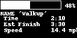

# SegmentComputer
Cycle computer based on raspberry pi which alerts users and tracks users during a Strava segment. Improve your segment times, train better

# In progress

GUI code currently in prototyping while GPS module and OLED display ship

  

 
# How to use

Run jsongen.py when connected to wifi, this will download your starred segments

Run apitest.py. This will connect to a neo 6-m gps module and an I2C OLED module displaying speed and time on ride. Ride on segements to display information about your favorite segements.
